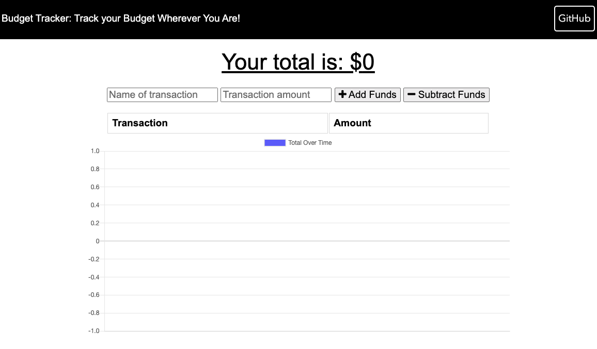

# Online/Offline Budget Trackers

## Table of Contents

- [Description](#description)
- [Technologies used](#technologies-used)
- [How to Install Dependencies](#how-to-install-dependencies)
- [Usage](#usage)
- [License](#license)
- [Contributoring](#contributing)
- [Tests](#tests)
- [Questions](#questions)

## Description

This application allows the user to add expenses and deposits to their budget with or without a connection. When entering transactions offline, it would populate the total when brought back online.

Please find the deployed application from here deloyed on Heroku:
https://salty-oasis-06752.herokuapp.com/

## Technologies used

- JavaScript
- HTML
- CSS
- MongoDB, Mongoose
- IndexedDB
- ServiceWorker
- Manifest
- npm packages

## How to install dependencies

Please use: npm i

## Usage

Screenshot 1: this is the UI the user would see once the application is up running.

---

Screenshot 2: The application allows the user to input the budget that would add/substract funds. 

---

This application works offline as well, using indexedDB and re-sync with Mongo when back to online. Chart.js is ready as a file to maintain the plot even when the user has no internet connection as well. 

## License

MIT

## Contributing

Pull requests are welcome. For major changes, please open an issue first to discuss what you would like to change. Also, please make sure to update tests as appropriate.

## Questions

[Email Me!](mailto:nishii.dev.syd@gmail.com)

[Link to my GitHub](https://github.com/noriyuki-ishii-820)
